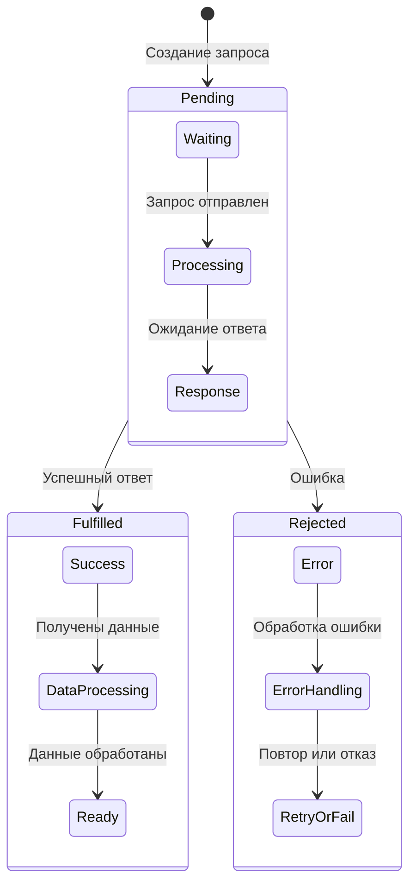
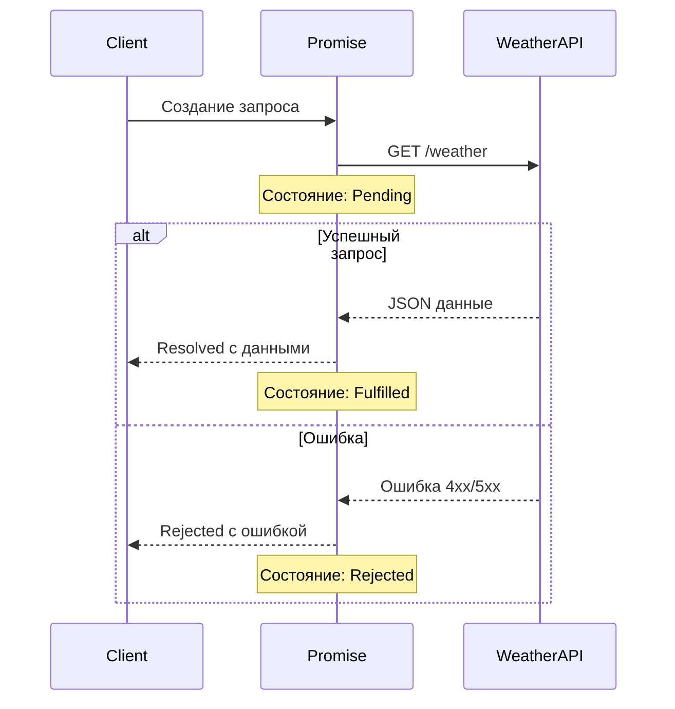

День 1 (3 часа):

Cookies и работа с ними (30 минут):

Что такое cookies и где хранятся
Чтение cookies через document.cookie
Запись новых cookies
Установка срока годности (expires, max-age)
Дополнительные параметры (path, domain, secure)

Теория (1 час):
Что такое JSON
Структура JSON
Методы JSON.parse() и JSON.stringify()
Преобразование объектов
Промисы и Fetch API (1 час):
Синхронный vs асинхронный код
Создание Promise
Методы Promise (.then(), .catch(), .finally())
Fetch API базовые принципы
GET и POST запросы
Практика (1 час):
Получение списка товаров с бэкенда
Отправка формы регистрации
Обработка ответов сервера
Базовая обработка ошибок

День 2 (3 часа):

Async/Await (1 час):
Синтаксис async/await
Промисы vs async/await
Обработка ошибок
Параллельные запросы (Promise.all())
Cookies и CSRF (1 час):
Работа с cookies в JavaScript
Получение CSRF токена из Django
Отправка защищенных POST запросов
Interceptors в fetch
Практические кейсы для Python/Django (1 час): Кейс 1: Корзина интернет-магазина
Добавление товара в корзину
Синхронизация корзины с localStorage
Отправка заказа на сервер
Кейс 2: Система лайков

Реализация лайка без перезагрузки
Обновление счетчика лайков
Предотвращение повторных лайков
Кейс 3: Чат с WebSocket

Получение истории сообщений
Отправка новых сообщений -Real-time обновления
Кейс 4: Фильтрация и поиск

Динамическая фильтрация товаров
Запросы с параметрами
Pagination
Кейс 5: Профиль пользователя

Загрузка аватара
Обновление информации
Валидация на клиенте и сервере

